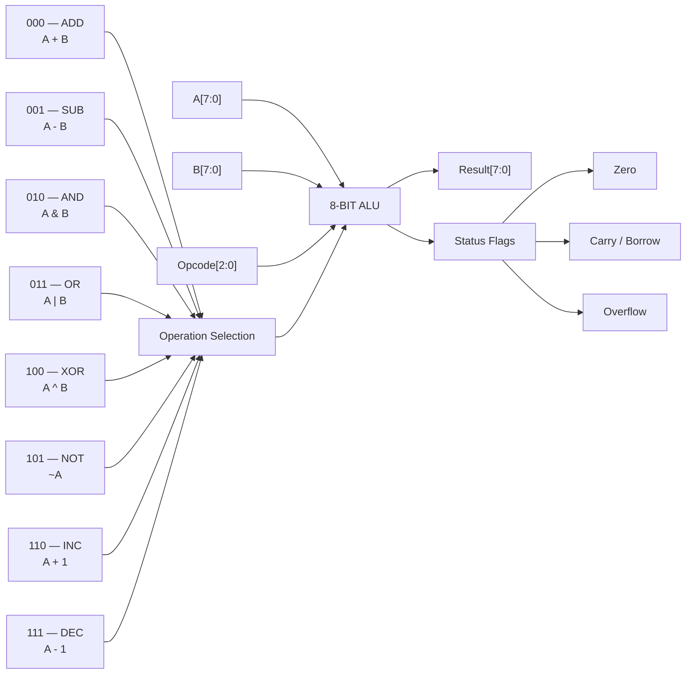

# 8-Bit ALU — RTL Design, Verification & Logic Optimization

A synthesizable **8-bit Arithmetic Logic Unit (ALU)** designed in Verilog HDL.

## Project Overview

This project implements an 8-bit ALU with eight operations selected using a 3-bit opcode.

## Operations

| Opcode | Operation |
|---|---|
| `000` | Addition |
| `001` | Subtraction |
| `010` | AND |
| `011` | OR |
| `100` | XOR |
| `101` | NOT |
| `110` | Increment |
| `111` | Decrement |

---

## Architecture

The 8-bit ALU receives two 8-bit operands and a 3-bit operation code.

The opcode selects the operation that the ALU performs.

### Block Diagram


## Flags

The ALU generates three status flags to provide additional information about the operation result.

### Zero Flag

The `zero` flag is asserted when the ALU result is zero.

Example:

```text
10 - 10 = 0

zero = 1      
```        

### Carry/Borrow Flag

For addition and increment operations, `carry` represents the carry-out from the most significant bit.

For subtraction and decrement operations, the same output is used as a borrow indicator.

Examples:

```text
255 + 1 = 0
carry = 1
```

### Signed Overflow Flag

The `overflow` flag indicates signed two's-complement arithmetic overflow.

Examples:

```text
127 + 1 = -128

overflow = 1
```

```text
-128 - 1 = 127

overflow = 1
```

---

## Project Structure

```text
vlsi_8bit_alu/
│
├── rtl/
│   └── alu_8bit.v
│
├── tb/
│   └── alu_8bit_tb.v
│
├── sim/
│   ├── alu_sim
│   ├── alu_sim_original
│   ├── alu_optimized_sim
│   ├── alu_waveform.vcd
│   ├── alu_synthesized.v
│   ├── alu_optimized.v
│   ├── synthesis_results.txt
│   └── synthesize.ys
│
└── README.md
```

---

## Functional Verification

A self-checking Verilog testbench was developed to automatically compare the ALU outputs against expected results.

The verification covers:

- Arithmetic operations
- Logical operations
- Zero detection
- Carry generation
- Borrow detection
- Signed overflow
- Boundary and corner cases

### Verification Result

```text
Total Tests : 14
Passed      : 14
Failed      : 0

Result: ALL TESTS PASSED
```

The same testbench was also used to verify the optimized gate-level netlist.

```text
Original RTL      : 14/14 tests passed
Optimized Netlist : 14/14 tests passed
```

---

## Synthesis

The Verilog RTL was synthesized using **Yosys** to generate a logic-level representation of the ALU.

### Original Synthesis Results

| Logic Cell | Count |
|---|---:|
| AND | 139 |
| MUX | 10 |
| NOT | 32 |
| OR | 138 |
| XOR | 46 |
| **Total** | **365** |

The synthesis process successfully converted the behavioral RTL description into a gate-level logic representation.

---
## Logic Optimization

The synthesized ALU logic was optimized using **ABC** through the Yosys synthesis flow.

### Optimized Synthesis Results

| Logic Cell | Count |
|---|---:|
| AND | 123 |
| MUX | 3 |
| NOT | 25 |
| OR | 98 |
| XOR | 29 |
| **Total** | **278** |

### Optimization Comparison

| Metric | Original | Optimized |
|---|---:|---:|
| Total cells | 365 | 278 |
| AND | 139 | 123 |
| MUX | 10 | 3 |
| NOT | 32 | 25 |
| OR | 138 | 98 |
| XOR | 46 | 29 |

### Cell Reduction

```text
Original cells  : 365
Optimized cells : 278
Cells reduced   : 87
Reduction       : approximately 23.8%
```

> **Important:** The cell reduction represents logic-cell/gate-level optimization. It is not a physical silicon area measurement because no standard-cell technology library or physical layout has been used.

---

## Waveform Analysis

The ALU was analyzed using **Surfer** with the generated VCD waveform.

The following signals were observed during simulation:

- `A[7:0]`
- `B[7:0]`
- `opcode[2:0]`
- `result[7:0]`
- `zero`
- `carry`
- `overflow`

The waveform was used to visually verify the relationship between the input operands, selected operation, output result, and status flags.

Waveform analysis provided an additional verification layer beyond the automated self-checking testbench.

---
## VLSI Design Flow

The project follows the following digital VLSI design flow:

```text
ALU Specification
       ↓
Verilog RTL Design
       ↓
RTL Simulation
       ↓
Self-Checking Verification
       ↓
Yosys Synthesis
       ↓
ABC Logic Optimization
       ↓
Optimized Netlist
       ↓
Post-Optimization Verification
       ↓
VCD Waveform Analysis
```

---
## Tools Used

| Tool | Purpose |
|---|---|
| Verilog HDL | RTL design |
| Icarus Verilog | Simulation |
| Yosys | RTL synthesis |
| ABC | Logic optimization |
| Surfer | Waveform analysis |
| VS Code | Development environment |
| Git/GitHub | Version control and project hosting |

---

## Learning Outcomes

This project provided practical experience with:

- Digital logic design
- RTL coding using Verilog HDL
- Combinational circuit design
- ALU architecture
- Arithmetic and logical operations
- Two's-complement arithmetic
- Carry, borrow, and overflow detection
- Self-checking testbench development
- HDL simulation
- VCD waveform analysis
- Logic synthesis using Yosys
- Logic optimization using ABC
- Gate-level netlist generation
- Post-synthesis verification
- Basic digital VLSI design flow

---

## Future Improvements

The project can be extended with:

- Parameterized ALU width
- 16-bit and 32-bit ALU versions
- Shift and rotate operations
- Comparison operations
- FPGA implementation
- Timing analysis
- Power estimation
- Area estimation using a standard-cell library
- Physical design and layout
- Power, Performance, and Area (PPA) optimization
- Integration with a simple CPU datapath

---

## Author

**Shikha Kumari**

B.Tech — Electrical & Electronics Engineering

This project is part of a practical VLSI/RTL design learning portfolio.